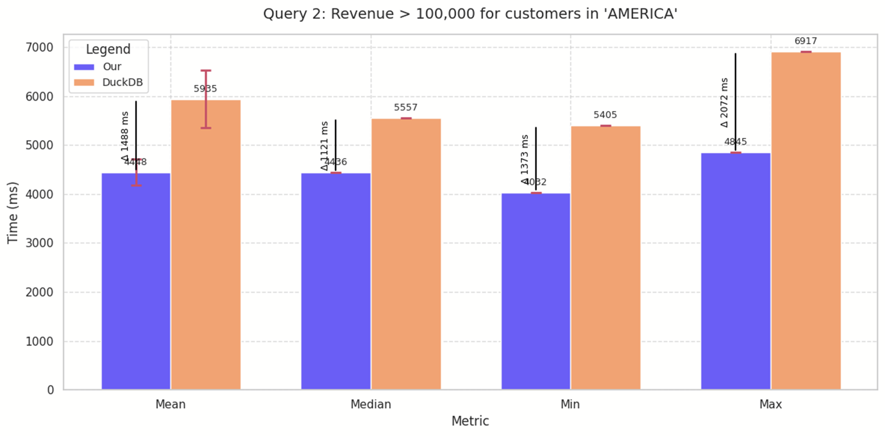

# 🚀 YallaSQL  

**Out-of-Core GPU Query Processor for Large CSV Files**


## Outline
1. Installation
1. How to Run?
    * Release
    * CPU-debug
    * CUDA-debug
1. Schema Support
1. Query Support
1. System Design
1. Yallasql vs DuckDB on SSB-Benchmark
    * How to build SSB-Benchmark?
    * Results

## 🛠️ Installation

1. 📦 Install [CMake](https://cmake.org/download/)
2. 🎮 Install the [CUDA Toolkit](https://developer.nvidia.com/cuda-downloads)
3. 🦆 Build DuckDB:
    ```bash
    cd vendor/duckdb
    make         # or "make debug"
    ```
4. 🪵 Install Quill for logging:
    ```bash
    conda install -c conda-forge quill
    ```
5. 🖥️ (Optional) Install `replxx` for CLI support:
    ```bash
    git clone https://github.com/AmokHuginnsson/replxx
    cd replxx
    mkdir build && cd build
    cmake -DCMAKE_BUILD_TYPE=Release ..
    make
    sudo make install
    ```

## 🏗️ How to Run

Use either the CLI or the base binary:

```bash
./build/<buildType>/yallasql_cli   # With CLI
./build/<buildType>/yallasql       # Without CLI
```

### 🏁 Release
```bash
mkdir build && cd build
cmake .. && make release
cd ..
./build/release/yallasql_cli
```
### 🐞 CPU-Debug
Make sure [ASAN](https://clang.llvm.org/docs/AddressSanitizer.html) is installed:
```bash
mkdir build && cd build
cmake .. && make debug

cd ../vendor/duckdb && make debug  # Build DuckDB in debug mode

# Use ASAN_OPTIONS to avoid CUDA conflicts
ASAN_OPTIONS=protect_shadow_gap=0:replace_intrin=0:detect_leaks=0 ./build/debug/yallasql_cli
```

### ⚙️ CUDA-Debug
```bash
mkdir build && cd build  && cmake .. && make cudadebug
cd ..
./build/cudadebug/yallasql_cli  
```

## 🧬 Schema Support

To mimic traditional database systems, YallaSQL supports schema annotations directly in the CSV header. You can specify each column's type and constraints using tags in parentheses:

### 📄 Example CSV Header:

```csv
"id (N) (P)","views (N)","weight (N)","address (T)","profit_margin (N)","altitude (N)",
"price (N)","shares (N)","category_id (N)","updated_at (D)","table_2_id (N)"
```

### 🏷️ Supported Tags:

* `(N)` → **Numeric** (integer or float)
* `(T)` → **Text** (up to 255 characters)
* `(D)` → **Date** in the format: `yyyy-MM-dd HH:mm:ss`
* `(P)` → **Primary Key**
* `refTable_refColumn` → **Foreign Key**, where `refTable` is the referenced table name and `refColumn` is the referenced column

### 📝 Notes:

* Tags can be combined, e.g., `id (N) (P)` means the column is numeric and a primary key.
* Foreign keys use a naming convention like `table_2_id` to imply reference to `table_2(id)`.

Here's an improved and clearer version of your **"Queries Support"** section, with correct grammar, consistent formatting, and more precise wording:


## 🔍 Query Support

YallaSQL **currently supports only `SELECT` queries** with the following features:
### Operators
* **Filtering**:
  Use `WHERE` clauses for conditional filtering.
  Example: `SELECT * FROM table WHERE price > 100;`

* **Projection**:
  Support for expressions like `2 * id`, `id + views`, etc.

* **Joins**:

  * **Inner Joins**
  * **Cross Products**

* **Sorting**:

  * `ORDER BY` with `ASC` (ascending) or `DESC` (descending)

* **Aggregations**:

  * `MAX()`, `MIN()`, `SUM()`, `AVG()`, `COUNT()`, `COUNT(*)`
* **subqueries**
### Examples
```bash
use folder_db_path; # to select folder contain csv files (eg., ssb-benchmark)

# to run query on yallasql_cli 
# the output will be save in `results/{timestamp.csv}`
# will also output statistics timing of 2 warmups and 5 runs
SELECT orderkey, 
        revenue, 
        revenue * (1 - discount) AS adjusted_revenue
FROM lineorder
WHERE orderpriority = '1-URGENT'
    AND revenue > (SELECT AVG(revenue) FROM lineorder WHERE orderpriority = '1-URGENT');
# to run duckdb
duckdb SELECT  ....;
# to get schema
duckdb DESCRIBE  table_name;
# to get execution plan in `results/{timestamp}.txt`
EXPLAIN SELECT ....;
# to get help
_help
# to exit cli
_exit
# to clear terminal
_clear
```

## Configuratinons
inside `/include/config.hpp` for CPU Config
```cpp
// Maximum string length in bytes
constexpr size_t MAX_STR_LEN = MAX_STR;
// Target maximum bytes per batch (4 mb)
constexpr size_t  MAX_BYTES_PER_BATCH = 4 * (1ULL << 20);
// Target maximum bytes per batch (2 gb)
constexpr size_t  MAX_LIMIT_CPU_CACHE = 2 * (1ULL << 30);
// Target maximum bytes per batch (1 gb)
constexpr size_t  MAX_LIMIT_GPU_CACHE = 1 * (1ULL << 30);

constexpr size_t MAX_ROWS_OUT_JOIN_OP = (MAX_BYTES_PER_BATCH + 3)/4;

const std::string cacheDir = ".cache";
const std::string resultDir = "results";

constexpr unsigned int GPU_ALIGNMENT = BLOCK_DIM;
```
in `/include/kernels/constants.hpp`
```cpp
#define COARSENING_FACTOR 2
#define BLOCK_DIM 256 
#define BLOCK_DIM_STR 16        // as it has very large size (256 byte):xd

#define NUM_BANKS 32            // change it depend on your gpu
#define LOG_NUM_BANKS 5         // log2(NUM_BANKS)
#define CONFLICT_FREE_OFFSET(n)((n) >> NUM_BANKS + (n) >> (2 * LOG_NUM_BANKS))

#define MAX_STR 256
```
in `include/kernels/merge_batchs.hpp`
```cpp
#define ELE_PER_TH 6
#define ELE_PER_BLOCK (ELE_PER_TH*BLOCK_DIM)
```
in `include/kernels/radix_sort_kernel.hpp`
```cpp
#define OUR_RADIX 4
#define BUCKET_SZ 16 // 1<<RADIX //! need to edit 
// get ith bit in x
#define GET_BIT(x,i) ((x >> i) & 1LL)
// get mask 000111 if radix = 3
#define MASK_ZERO ((1LL << (OUR_RADIX)) - 1LL)
// get mask of iter 000111000 if iter = 1
#define MASK_ITER(iter) (MASK_ZERO << (iter*OUR_RADIX))
// get radix for certain iter
#define GET_RADIX_KEY(x,iter) ((x>>(iter*OUR_RADIX)) & MASK_ZERO)
```

## System Design
- Memory Style: **out-core** instead of in-memory
- execution plan: **pull execution plan**
- trade-offs between virtualizations and templates
    - templates make code more complex but faster
    - virtualizations more clean code but slower as need to look on virtual table
- modern debug tools: `ASAN` for cpu, `compute-sanitizer` for cuda
- compiler flags: `-O3` for release `-G` for debugging cuda

### Quick-Look on Modules
- CLI is basically UI where it have (history, syntax hinting, syntax coloring)
- QueryEngine: generate duckdb plan and pass it to execution
- DB + Table: parsing tables and relations between them
- don't let duckdb to parse csv files as it take longs -- instead parsing schema and `CREATE tables` 
- currency hold is `unique_ptr<Batch>` where `Batch` is columnStore some rows with theirs nullset
- utlizing buffers in Scanning and writing 
- utlizing Async in writing so CPU don't stop all operations only to write
- CacheManager smoothly move batchs between GPU->CPU->FS depend on FIFO and  


## 📊 Yallasql vs DuckDB on SSB-Benchmark
```bash
cd benchmark/ssb-dbgen
make
./dbgen -s 1 -T c
./dbgen -s 1 -T p
./dbgen -s 1 -T s
./dbgen -s 1 -T d
./dbgen -s 1 -T l
./python benchmark/script/ssb_to_ta_format.py 
```

### Results
#### Query 1


effect of max batch size

#### Query 2


#### Query 3


#### Query 4


#### Query 5


#### Query 6


